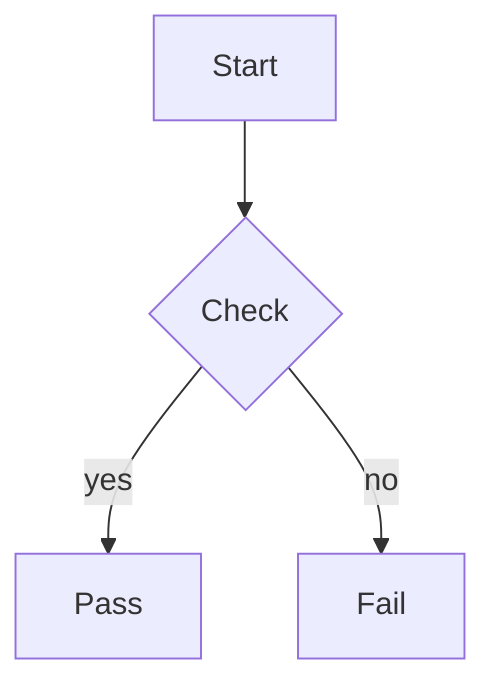

# 文档地图

这是一个用于真实 Chromium 预览的集成测试夹具。

| 模块 | 状态 |
| --- | --- |
| Markdown | OK |
| Mermaid | OK |

```python
def greet(name: str) -> str:
    return f"hello, {name}"
```



```mermaid
flowchart TD
    A -->>
```


相关资料：[[linked-note|关联笔记]] 与 [[missing-note|缺失笔记]]

远程探针（应被阻断）：

[remote-link](https://example.invalid/page)
